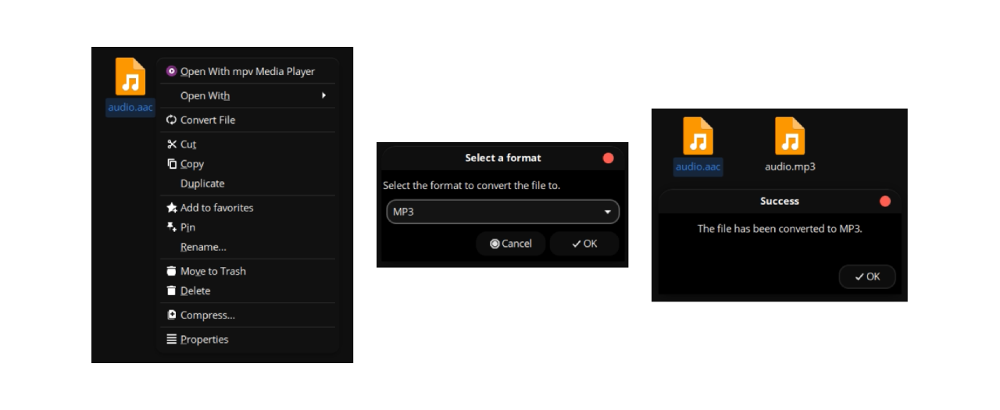

# Convert File

This is a simple script to convert a file from one format to another.

## Description

It can convert:
- Images into:
`bmp`
`gif`
`heic`
`ico`
`jpeg`
`png`
`tiff`
`webp`
  
- Audios into:
`aac`
`aiff`
`flac`
`m4a`
`mp3`
`ogg`
`opus`
`wav`
`wma`

- Videos into:
`3gp`
`avi`
`flv`
`mkv`
`mov`
`mp4`
`webm`

## Dependencies

- [ffmpeg](https://ffmpeg.org/)
- [ImageMagick](https://imagemagick.org/index.php)
- [Python 3](https://www.python.org/)

## Screenshots

