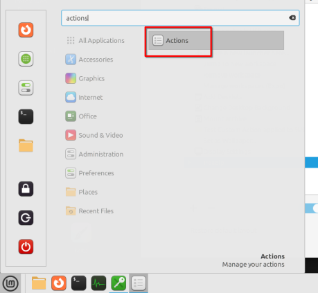
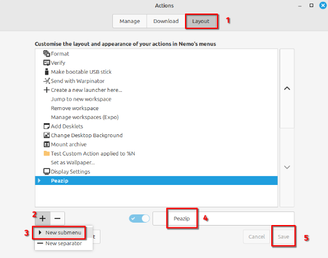
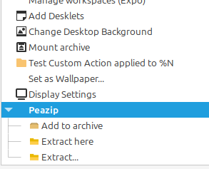

# Peazip add to archive

Adds **Add to archive** action to the context menu (right-click menu) for the Nemo file manager. This makes zipping and unzipping zip (and other) files more convenient.

## Prerequisites

Install the Flatpak version of PeaZip from the Software Manager.

> [!IMPORTANT]
> These files require the Flatpak version, they will not work if you installed the .deb package from the PeaZip website.

### How to group actions

This feature is available from Linux Mint **22**.

1. Open the **Actions** window.

    

2. Switch to the Layout tab

    

3. Click the **+** symbol and select the new submenu option
4. Choose a group name (in this case PeaZip)
5. Click *Save*
6. Now drag the actions on the new submenu with the mouse. The result will look like this:

    

7. Click *Save*

## Older versions

You can find the older versions of this action in a separate [repository](https://github.com/xszabo3/peazip-context-menu-items-nemo).

## Sources

The files are **not** 100% written by me. You can find the license and copyright information of the original files in the files directly or in the accompanying note in the folder.

Here is a list of used sources

- [PeaZip](https://github.com/peazip/PeaZip/) - PeaZip is released under LGPLv3 by Giorgio Tani.

- [The original actions](https://github.com/badmotorfinger/nemo-peazip-context-menu/) are released under MIT by badmotorfinger.
