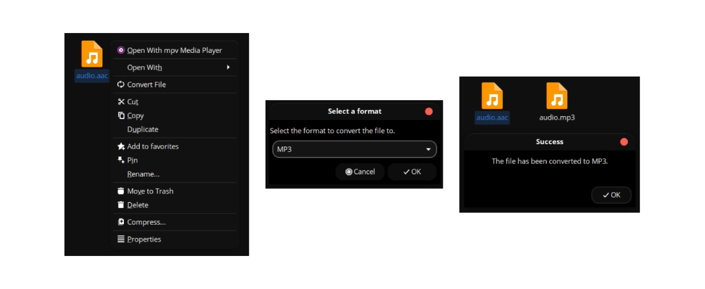

# Simply Convert File

A Nemo action for converting files between different formats. Right-click any supported file in the file manager to convert it.



## About

This Nemo action is a thin integration layer that calls [SimplyConvertFile](https://github.com/thigschuch/simplyconvertfile), a standalone file conversion application. All conversion logic, format support, configuration, and UI are provided by the standalone app.

### Highlights

- **80+ supported formats** across images, video, audio, documents, and archives
- **Single & batch conversion** with progress tracking and cancellation
- **Cross-format conversions** (e.g., video to audio, GIF to video, documents to PDF)
- **Customizable** quality settings, conversion rules, and notifications
- **Internationalization** with 14+ languages

For full documentation on features, configuration, supported formats, and troubleshooting, see the [SimplyConvertFile README](https://github.com/thigschuch/simplyconvertfile).

## Dependencies

- **[SimplyConvertFile](https://github.com/thigschuch/simplyconvertfile)** — the standalone conversion application

Install it by downloading the latest `.deb` package from the [SimplyConvertFile releases](https://github.com/thigschuch/simplyconvertfile/releases):
```bash
sudo dpkg -i simplyconvertfile_*.deb
```

SimplyConvertFile has its own dependencies for format-specific conversions (ImageMagick, FFmpeg, LibreOffice, etc.). See its documentation for details.

## Installation

### From Cinnamon Spices (Recommended)
1. Open **System Settings** → **Actions** (under Preferences)
2. Click **Download** → Search for "Simply Convert File" → **Install**
3. Install SimplyConvertFile from the [releases page](https://github.com/thigschuch/simplyconvertfile/releases): `sudo dpkg -i simplyconvertfile_*.deb`

### Manual Installation
1. Clone and copy the action files:
   ```bash
   git clone https://github.com/ThigSchuch/cinnamon-spices-actions.git
   cd cinnamon-spices-actions/convert-file@thigschuch
   mkdir -p ~/.local/share/nemo/actions
   cp convert-file@thigschuch.nemo_action.in ~/.local/share/nemo/actions/convert-file@thigschuch.nemo_action
   ```

2. Install SimplyConvertFile from the [releases page](https://github.com/thigschuch/simplyconvertfile/releases):
   ```bash
   sudo dpkg -i simplyconvertfile_*.deb
   ```

3. Restart Nemo:
   ```bash
   nemo -q
   ```

## Usage

1. Right-click a file (or select multiple files) in Nemo
2. Select **"Simply Convert File"** from the context menu
3. Choose the target format and convert

For detailed usage instructions, batch conversion, keyboard shortcuts, configuration options, and more, see the [SimplyConvertFile documentation](https://github.com/thigschuch/simplyconvertfile).

## License

See [COPYING](../COPYING) file for license information.

## Author

**ThigSchuch**